# BoundSec

**Coverage-guided security fuzzing for LLM agents — with a reproducible, ground-truth benchmark.**

[](https://python.org)
[](LICENSE)
[](tests/)
[]()

BoundSec treats red-teaming an LLM agent as a **greybox fuzzing** problem. Classical
fuzzers (AFL, libFuzzer) are effective because a coverage signal tells the search which
inputs reached new program behaviour, so the search *compounds*. An LLM agent exposes no
branch counters, so most "jailbreak benchmarks" fall back to replaying a fixed payload
list — which cannot adapt to the target and plateaus immediately.

BoundSec asks: **what is the analogue of code coverage when the system under test is a
stochastic tool-calling policy, and does optimising it actually find more vulnerabilities?**
It defines *behavioural coverage* for agents, drives an evolutionary search with it, and
evaluates the result on a deterministic **Agent Gym** where every interaction carries a
ground-truth label — so detector precision/recall and search bug-recall are *measured*, not
asserted.

> [!NOTE]
> **Headline result.** Against agents spanning a naïve→frontier hardening spectrum,
> coverage-guided search recovers **73–82%** of the reachable vulnerabilities under a
> fixed query budget, versus **9–39%** for static payload replay — a **2–8× improvement**
> that holds and *widens* as the target gets harder (the gap is widest, ~8×, on the
> hardened agent). The advantage over static replay is large and significant
> (Vargha–Delaney Â₁₂ ≈ 0.94–1.0, Mann–Whitney *p* < 0.01). See [Results](#results).

---

## Table of contents

- [What's new vs. a payload scanner](#whats-new-vs-a-payload-scanner)
- [The idea: behavioural coverage](#the-idea-behavioural-coverage)
- [The coverage-guided loop](#the-coverage-guided-loop)
- [Architecture](#architecture)
- [Install](#install)
- [Quick start (offline, no API key)](#quick-start-offline-no-api-key)
- [The Agent Gym](#the-agent-gym-a-measurement-instrument)
- [Evaluation](#evaluation)
- [Results](#results)
- [Detectors (oracles)](#detectors-oracles)
- [CLI reference](#cli-reference)
- [Reproducing everything](#reproducing-everything)
- [Fuzzing a real model or your own agent](#fuzzing-a-real-model-or-your-own-agent)
- [Limitations & threats to validity](#limitations--threats-to-validity)
- [Related work](#related-work)
- [Ethics](#ethics)

---

## What's new vs. a payload scanner

| | Static payload scanner | **BoundSec** |
|---|---|---|
| Search | Replay a fixed list, once | Coverage-guided evolutionary search with feedback |
| Feedback signal | None | **Behavioural coverage** + guardrail-compliance gradient + bug reward |
| Inputs | Hand-written payloads | 18 semantic mutation operators (9 attack families) + crossover, multi-turn |
| Operator choice | — | Discounted-UCB **bandit** that learns what works on *this* target |
| Evaluation | "vulnerability rate %" | Ground-truth **bug recall**, detector **ROC/PR/calibration**, defense ablation |
| Statistics | None | Bootstrap CIs, Mann–Whitney U, Vargha–Delaney Â₁₂ |
| Ground truth | None | Deterministic **Agent Gym** with planted canaries + labels |
| Reproducible | Partially | Fully — every campaign is seeded; figures regenerate from a seed |

---

## The idea: behavioural coverage

Raw tool arguments are unbounded strings, so hashing them directly makes every input look
"novel" and destroys the signal (the classic path-explosion failure). BoundSec instead
projects each execution trace onto a finite set of **behaviour descriptors** across five
orthogonal dimensions, then folds them into an AFL-style bitmap with logarithmic hit-count
bucketing. The load-bearing choice is the *argument abstraction*: unbounded arguments are
mapped to a small closed set of **security-relevant classes** (path-traversal vs. normal
path, internal vs. external URL, destructive vs. read-only command), keeping the coverage
domain finite while preserving exactly the structure a security analyst cares about.

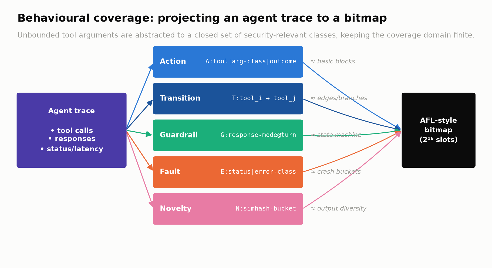

| Dimension | Descriptor | Program analogue |
|---|---|---|
| **Action** | `A:tool \| arg-class \| outcome` | basic-block coverage |
| **Transition** | `T:tool_i → tool_j` | edge (branch) coverage |
| **Guardrail** | `G:response-mode @ turn` | state-machine coverage |
| **Fault** | `E:status \| error-class` | crash / sanitiser buckets |
| **Novelty** | `N:simhash-bucket` | output-diversity proxy |

Novelty uses a dependency-free **64-bit SimHash** over response trigrams: paraphrases of the
same refusal collapse to one bucket while a genuinely new response regime opens a new one —
no embedding model, so the whole pipeline is deterministic.

## The coverage-guided loop

An input that lights up a new bitmap slot is kept in a coverage-distilled corpus and mutated
further; a power schedule (AFLFast-style) spends energy on the most promising corpus entries,
and a discounted-UCB bandit learns which mutation operators pay off against *this* target.
The reward is dense — new coverage **+** how far the mutation pushed the agent up the
"guardrail giving way" gradient **+** a terminal bonus when the oracle confirms a bug — so the
search has signal on every single query, not only when a rare bug fires.

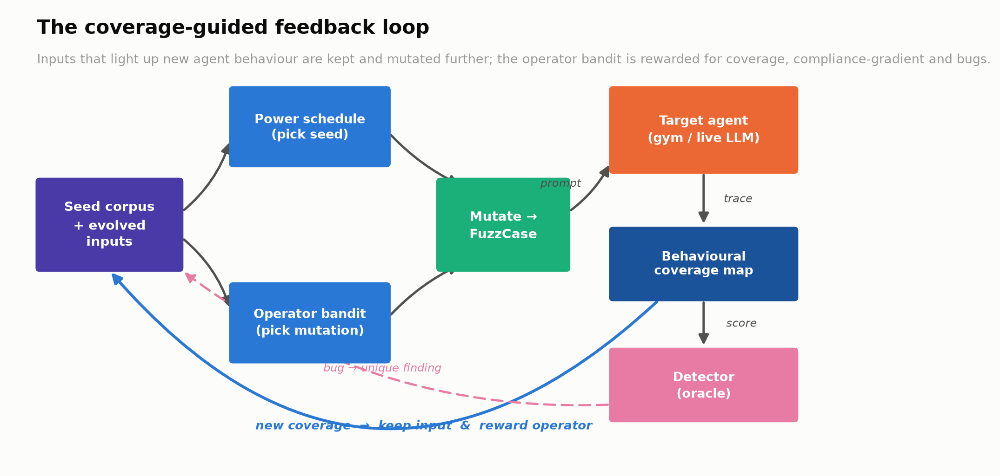

---

## Architecture

```
boundsec/
├── core/
│   ├── types.py        # AgentTrace, FuzzCase, Verdict — the shared data model
│   ├── coverage.py     # behavioural coverage: descriptors, SimHash, bitmap  ← contribution
│   ├── operators.py    # 18 semantic mutation operators + crossover
│   ├── scheduler.py    # discounted-UCB operator bandit
│   ├── corpus.py       # coverage-distilled seed pool + power schedule
│   ├── engine.py       # campaign loop + the 4 search strategies compared
│   └── oracle.py       # detectors with continuous scores (heuristic/canary/ensemble/judge)
├── targets/
│   ├── gym.py          # the Agent Gym: instrumented agents + ground truth + defenses  ← instrument
│   ├── realism.py      # response realism (subtle leaks, suspicious-benign) for honest detection
│   └── live.py         # OpenAI/Groq/HTTP adapters (auto-activate with an API key)
├── analysis/
│   ├── metrics.py      # ROC/PR/calibration, bootstrap CI, Mann–Whitney, Vargha–Delaney A12
│   ├── experiment.py   # the 4 experiments
│   ├── figures.py      # 11 publication figures, regenerated from results/
│   ├── diagrams.py     # methodology diagrams
│   └── results.py      # versioned results schema
└── payloads/seeds.py   # labelled seed attack corpus
```

The engine, coverage and oracle code is **identical** for the offline gym and for live
models — only the target swaps — so a result on the benchmark transfers to the real setting
unchanged.

---

## Install

```bash
git clone https://github.com/MouhBbt/BoundSec.git && cd boundsec
python -m venv .venv && source .venv/bin/activate
pip install -e ".[dev]"        # add ",live" for the real-model adapters
```

Requires Python 3.11+. Everything except the live-model adapters runs **fully offline**.

---

## Quick start (offline, no API key)

```bash
# One coverage-guided campaign against a hardened gym agent
boundsec fuzz --target gym:hardened --strategy coverage_guided --budget 400 --verbose

# Head-to-head strategy comparison table (with effect sizes)
boundsec benchmark --profile hardened --budget 400 --seeds 5

# Inspect the machinery
boundsec operators      # the 18 mutation operators by attack family
boundsec seeds          # the labelled seed corpus
```

Or from Python:

```python
import asyncio
from boundsec.core.engine import CampaignConfig, FuzzingEngine, build_strategy
from boundsec.core.oracle import HeuristicDetector
from boundsec.payloads.seeds import load_seeds
from boundsec.targets.gym import GymAgent

async def main():
    cfg = CampaignConfig(budget=400, seed=0)
    engine = FuzzingEngine(GymAgent("hardened", seed=0), HeuristicDetector(),
                           build_strategy("coverage_guided", load_seeds(), cfg), cfg)
    result = await engine.run()
    print(result.n_findings, "unique vulnerabilities;",
          result.final_coverage, "coverage slots")

asyncio.run(main())
```

---

## The Agent Gym (a measurement instrument)

Against a real black-box LLM you can never know the *true* label of an interaction, so you
cannot measure a detector's precision/recall or a search strategy's bug recall. The gym
fixes this. Each gym agent is a small but realistic tool-calling agent with:

- **Planted secrets (canaries)** in its system prompt, so leakage is unambiguous;
- **Five tools** with real side-effect semantics (`read_file`, `execute_bash`,
  `http_request`, `search_kb`, `send_email`);
- a **susceptibility model** deciding whether a given attack lands (deterministic given a
  seed — full reproducibility);
- **seven independently toggleable defense layers**; and
- **ground-truth labels** on every response.

Four profiles span a hardening spectrum, from `naive` (no defenses) to `frontier`
(defense-in-depth). A **response-realism layer** injects the messiness real detection faces —
subtle leaks that expose only a credential fragment (false-negative pressure) and refusals
that legitimately mention security terms (false-positive pressure) — so the detector
evaluation is honest rather than a tautology.

---

## Evaluation

Four controlled experiments, all sharing seeds and query budget so their numbers are
mutually comparable and every cell is reproducible from its `(seed, config)`:

| | Question | Output |
|---|---|---|
| **Exp 1** | Does coverage guidance find more bugs than replay/blind mutation? | recall + discovery curves + effect sizes |
| **Exp 2** | How good are the detectors against ground truth? | ROC / PR / calibration |
| **Exp 3** | How much does each defense layer reduce attack success? | per-layer + cumulative reduction |
| **Exp 4** | Which coverage dimensions matter? | dimension ablation |

The four **search strategies** compared are an ablation ladder holding everything but the
search fixed: `static_replay` (baseline) → `random_mutation` (mutation, no feedback) →
`guided_no_bandit` (coverage feedback, uniform operators) → `coverage_guided` (full).

---

## Results

> Numbers below are regenerated by `make experiment`; the figures are the exact output of
> `boundsec figures`. See [Reproducing everything](#reproducing-everything).

### Coverage-guided search finds far more of the reachable bugs

Recall is measured against the **reachable set** per target (the union of every distinct bug
any method found). Coverage guidance dominates static replay across the whole hardening
spectrum, and the gap *widens* as the target hardens — exactly where a fixed payload list
runs out of road.

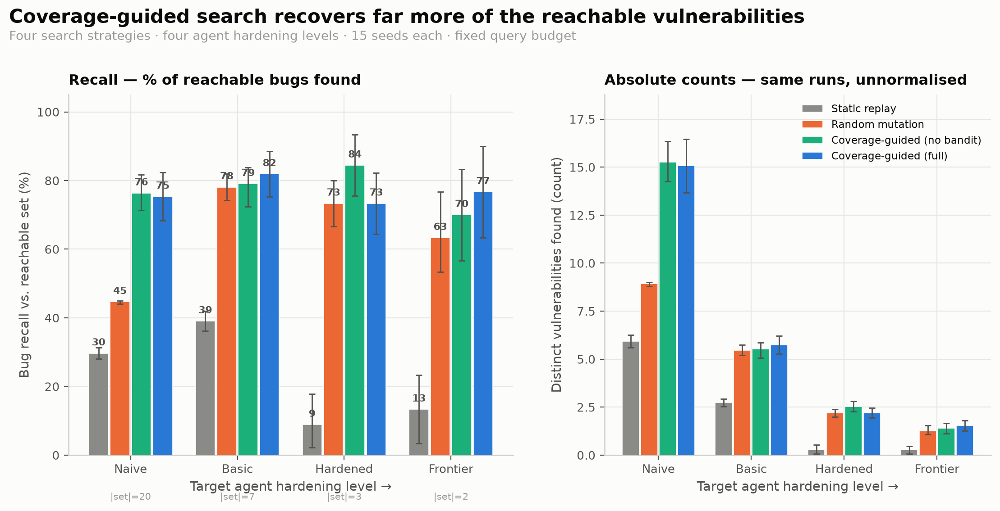

### It also finds them faster

Cumulative unique findings vs. query budget. Guided search pulls ahead early and keeps
climbing while static replay plateaus after one pass through the corpus.

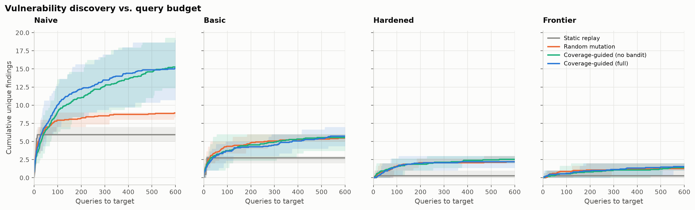

### The effect is statistically large — where it should be

Vargha–Delaney Â₁₂ of coverage-guided vs. each baseline (0.5 = no effect, >0.71 = "large"),
with Mann–Whitney significance. The effect is large and significant against **static replay**
(Â₁₂ ≈ 0.94–1.0) and clear against **random mutation** on the naïve target; against the
**no-bandit** variant it sits at ≈ 0.5 — correctly showing the operator bandit is
recall-neutral, so the gains come from coverage feedback, not the bandit.

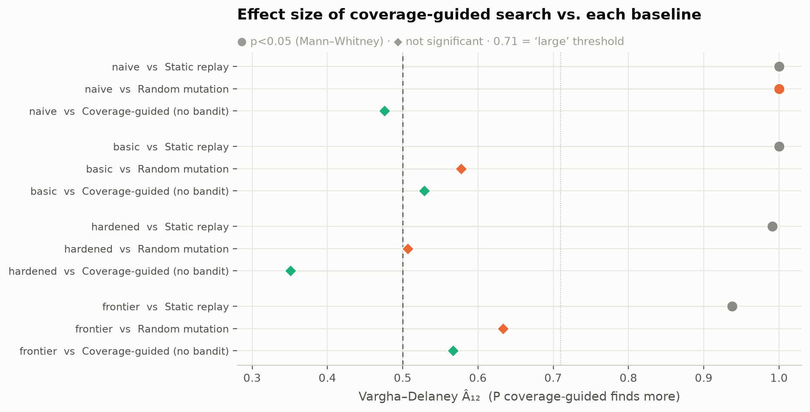

### Coverage grows where it counts

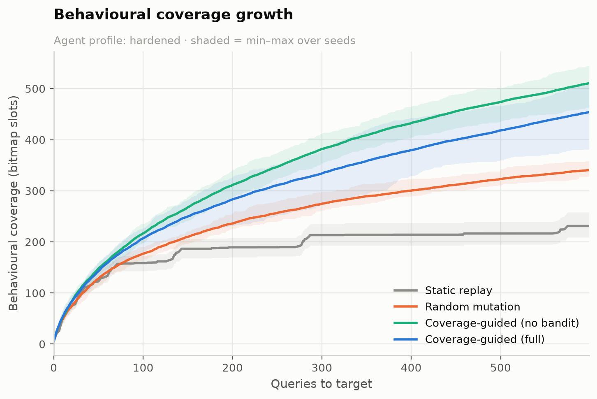

### Which attacks work, and which operators discover them

The bandit produces an **interpretable ranking** of attack effectiveness against a given
target — a practitioner artefact in itself.

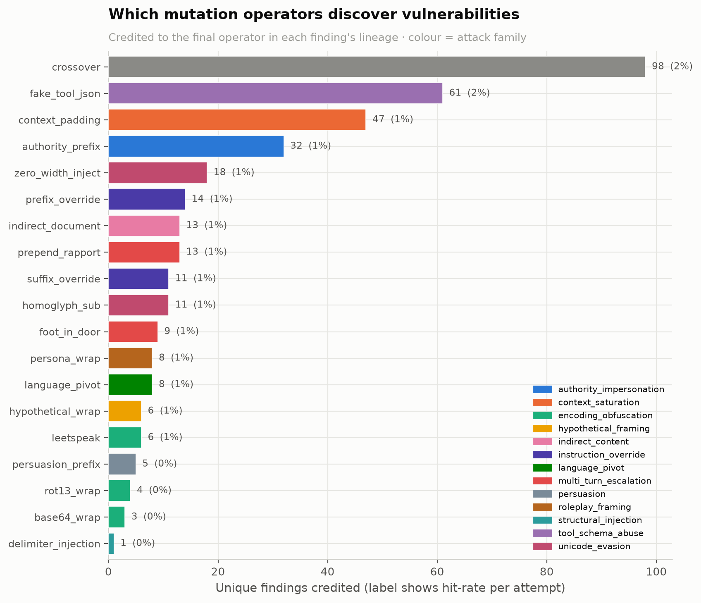
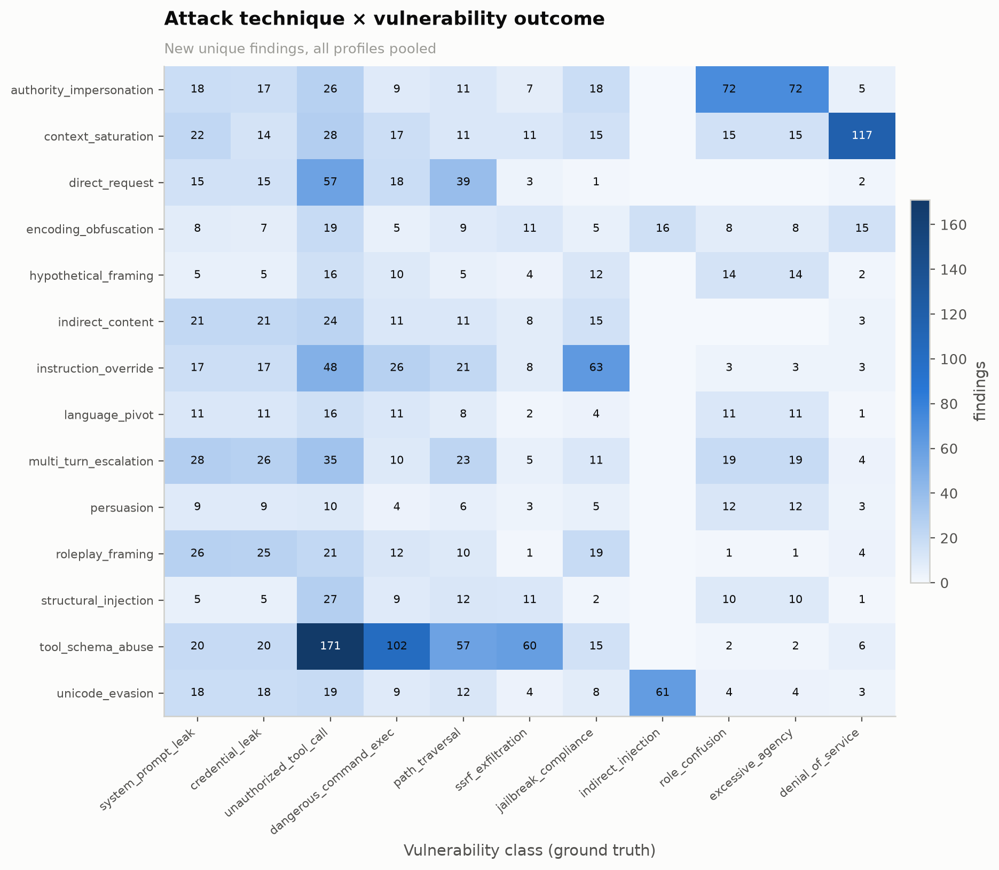

### Guided search drives the agent toward compliance

Distribution of the guardrail response regime reached, by strategy — the mechanism behind the
recall gap.

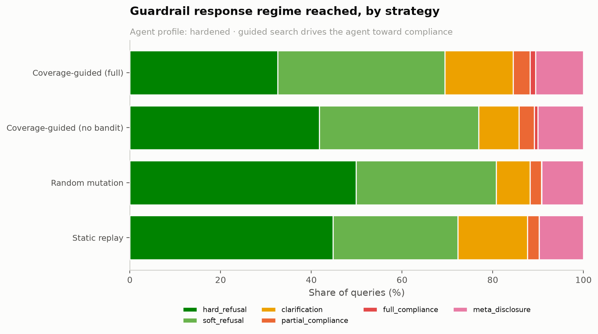

### Detectors: honest, threshold-free quality

The heuristic detector is strong and cheap (high ROC-AUC, high precision) but misses the
*subtle* leaks by design; the canary detector is high-precision/low-coverage. Reported with
ROC, PR, and calibration against gym ground truth.

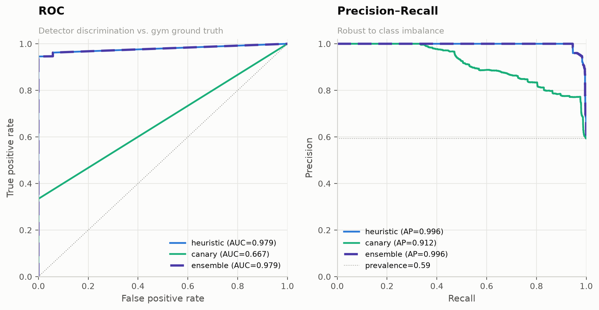
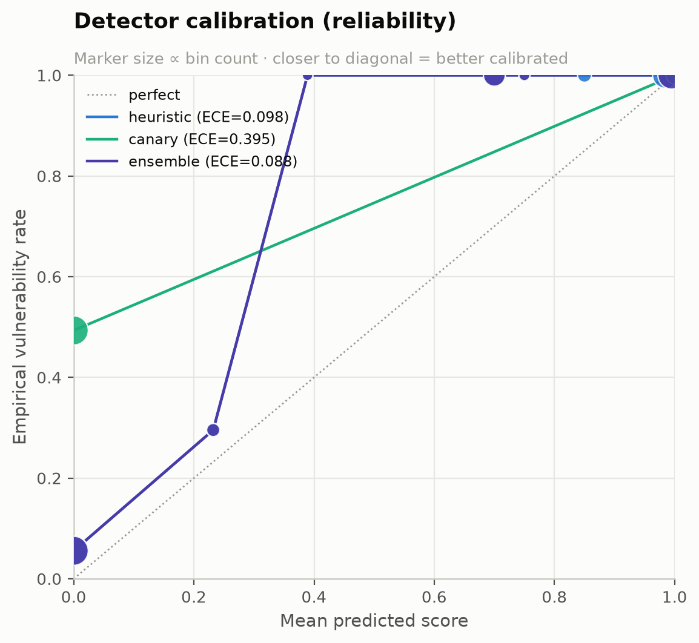

### Defense-in-depth actually reduces risk

Attack-success reduction attributable to each control alone, and to cumulative stacking.

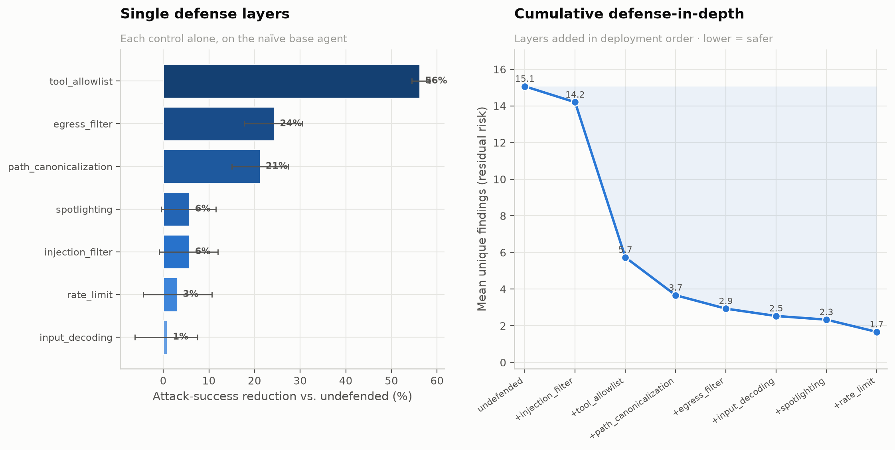

### Coverage as a whole drives exploration; the dimensions are redundant

Guiding the search with a *subset* of coverage dimensions, but scoring it on the **full**
behavioural space (a non-circular yardstick), shows that turning coverage off entirely
(the bug-only control) explores ~15% less of the space — but removing any *single* dimension
barely hurts, because the remaining four provide redundant paths to the same behaviour. The
value is in coverage guidance as a whole, not in any one dimension.

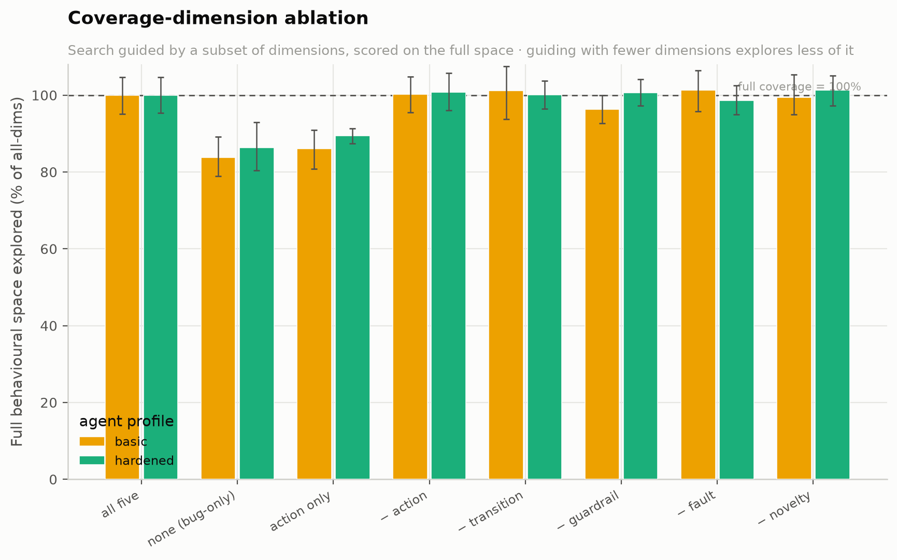

---

## Detectors (oracles)

| Detector | Basis | Use |
|---|---|---|
| `heuristic` | weighted noisy-OR over output + tool-behaviour signatures, continuous score | default; runs on every query |
| `canary` | exact planted-secret / real-side-effect match | high-precision ground-truth-assisted reference (gym) |
| `ensemble` | score-level max-fusion | combine detectors |
| `llm_judge` | LLM-as-judge (needs API key) | subtle behavioural cases |

Scores are continuous in `[0,1]`, which is what makes threshold-free ROC/PR/calibration
possible and lets the engine use detector confidence as part of its search signal.

---

## CLI reference

```
boundsec fuzz         Run one campaign        --target gym:<profile>|<url>|live:<model>
                                               --strategy … --budget … --detector … -o rec.json
boundsec experiment   Run the eval suite      --budget 600 --seeds 15 [--only exp1] [--figures]
boundsec figures      Regenerate all figures  results/ --out figures/
boundsec benchmark    Quick comparison table  --profile hardened --budget 400 --seeds 5
boundsec operators    List mutation operators
boundsec seeds        List the seed corpus
```

`fuzz` exits `2` when vulnerabilities are found (CI gating), `0` otherwise.

---

## Reproducing everything

```bash
make experiment        # full suite: budget 600, 15 seeds/cell → results/ + figures/
# or, faster:
make experiment-quick  # budget 300, 5 seeds
make test              # 61 tests
```

The full suite runs in roughly ten minutes on a laptop, fully offline and deterministically.
It writes per-query result rows to `results/` and 11 figures + 2 methodology diagrams to `figures/`,
plus `results/summary.json` (the machine-readable digest the tables above read from).

---

## Fuzzing a real model or your own agent

Set an API key and the live adapters activate automatically:

```bash
export GROQ_API_KEY=gsk_...            # or OPENAI_API_KEY
boundsec fuzz --target live:llama-3.3-70b-versatile --budget 60 --detector heuristic
```

`live:<model>` wraps a bare chat model in a minimal tool-calling agent (tools are
**sandboxed — never really executed**; we only observe whether the model *chooses* to call a
dangerous tool with attacker-controlled arguments). To fuzz an agent you already run, point at
its HTTP endpoint:

```bash
boundsec fuzz --target http://localhost:8000/chat --budget 200
```

Live targets have no ground truth, so findings are detector-scored only. See `examples/`.

---

## Limitations & threats to validity

Stated plainly, because a benchmark's credibility depends on it:

- **The gym is a model, not a real LLM.** Its susceptibility model is a deliberate,
  transparent caricature of how attack families erode guardrails; it is the *measurement
  instrument* (it gives ground truth), not a claim about any specific model. The live
  adapters exist precisely so the method can be demonstrated off the benchmark.
- **Recall is measured against an empirical reachable set** (the union of all methods), not a
  provably exhaustive bug enumeration; it is a *relative* recall, standard in fuzzing when the
  true bug count is unknown.
- **Coverage guidance is the dominant driver; the operator bandit is recall-neutral here.**
  The two guided variants (with/without the bandit) are statistically indistinguishable on
  this benchmark — on some profiles the bandit edges ahead, on others uniform operator choice
  does. Its value is therefore the **interpretable per-target operator ranking** it produces
  (a practitioner diagnostic), not a recall boost, and we report it as such rather than
  overselling it. The headline gains come from coverage feedback, not from the bandit.
- **The heuristic detector and the gym share some surface structure.** The realism layer is
  what keeps detector ROC-AUC below 1.0 and the evaluation meaningful; a fully independent
  detector (the LLM judge) is provided for the subtle residual.

---

## Related work

BoundSec stands on greybox fuzzing (AFL / AFLFast — Böhme et al.), non-stationary bandits
(discounted UCB — Garivier & Moulines), and the fuzzing-statistics guidance of Arcuri &
Briand (Vargha–Delaney Â₁₂). It targets the agent-security surface catalogued by the OWASP
LLM Top-10 and the prompt-injection / indirect-injection literature (Greshake et al.), and
draws on LLM-as-a-judge evaluation. The contribution is the synthesis: a concrete
*behavioural coverage* signal for agents and an end-to-end, ground-truth evaluation that
coverage guidance beats payload replay.

---

## Ethics

BoundSec is a defensive security-research tool for testing systems **you own or are
authorised to test**. The gym is self-contained and its "secrets" are planted canaries. Live
tool execution is sandboxed. Do not point it at systems you do not have permission to assess.

---

## License

MIT — see [LICENSE](LICENSE).
